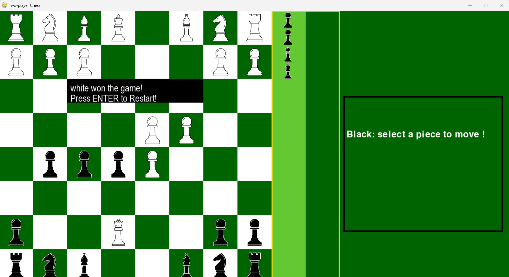

# ♟️ GambitAI — AI-Powered Chess Web App
## Web app: [](https://gambitai.vercel.app)

I had developed a simple **two-player chess game built in Python + Pygame** during my 1st year of college.


## GambitAI is a 2-player chess web app where you can play with friends, get coached by Stockfish + Groq AI, and scout opponents using Lichess and Chess.com data.

⚠️ Note: Opponent scouting is powered by the Lichess API which is fully open and free. Chess.com scouting may work partially or not at all as Chess.com does not provide a fully public API and restricts access to most player data.

## ✨ Features

### Game Modes
- **Classic 2 Player** — play online with a friend via shareable room link, no account needed
- **Dice Chess** — a random piece is rolled before every move, you must move that piece
- **AI Coach Mode** — 3 lifelines per game, ask Stockfish + Groq for the best move with a reasoning

### AI Features
- **Stockfish** finds the best move at depth 10
- **Groq API(llama-3.1-8b-instant)** provides post game analysis and reasoning 
- **Post-game analysis** — full game breakdown streamed word by word after match ends
- **Opponent scouting** — paste a Lichess/Chess.com profile URL or usernames to get ratings, win/loss stats and an AI scouting report before your game

### Technical Highlights
- Real-time multiplayer via WebSockets
- Full chess rules 
- Move highlighting and drag & drop board
- AI post-game analysis and reasoning
- Responsive — works on mobile and desktop
- Installable as a PWA — add to homescreen on any phone

## 🛠️ Tech Stack

### Frontend


### Backend


### AI & Data


### Deployment


---

## 🏗️ Architecture

Player A (Browser) ←── WebSocket ──→ FastAPI Server ←── WebSocket ──→ Player B (Browser)
                                           │
                                    python-chess (rules)
                                    Stockfish (best move)
                                    Groq LLaMA 3 (explanation)
                                    Lichess API (scouting)


---
## Game Modes Guide

### ♟️ Classic 2 Player
1. Click **Classic 2 Player**
2. Share the room ID with your opponent via WhatsApp or any messenger
3. They open the link — no account needed
4. Play!

###  AI Coach Mode
- You get **3 lifelines** per game
- Click **"Ask Coach"** when stuck
- Stockfish finds the best move at depth 10
- Groq explains why in plain english
- Accept or reject — your choice

###  Dice Chess
- A piece type is **randomly rolled** before each move
- You must move that piece type
- Auto re-rolls if no legal moves exist

---
### Run Locally

### Prerequisites
- Python 3.11+
- Node.js or Bun
- Groq API key from [console.groq.com](https://console.groq.com)

### Backend
```bash
cd backend
pip install -r requirements.txt
cp .env.example .env
# add your GROQ_API_KEY to .env
uvicorn app.main:app --reload
```

### Frontend
```bash
cd frontend
bun install
cp .env.example .env
# set VITE_API_URL=http://localhost:8000
bun run dev
```

Open `http://localhost:5173` in two tabs to test multiplayer locally.

---
Environment Variables

### Backend `.env`
```
GROQ_API_KEY=your_groq_api_key
FRONTEND_URL=https://your-vercel-app.vercel.app
```

### Frontend `.env`
```
VITE_API_URL=https://your-render-app.onrender.com
VITE_WS_URL=wss://your-render-app.onrender.com
```
## Install as App

**Android:**
1. Open [gambitai.vercel.app](https://gambitai.vercel.app) in Chrome
2. Tap three dots menu → **"Add to Home Screen"**

**iPhone:**
1. Open [gambitai.vercel.app](https://gambitai.vercel.app) in Safari
2. Tap Share → **"Add to Home Screen"**

